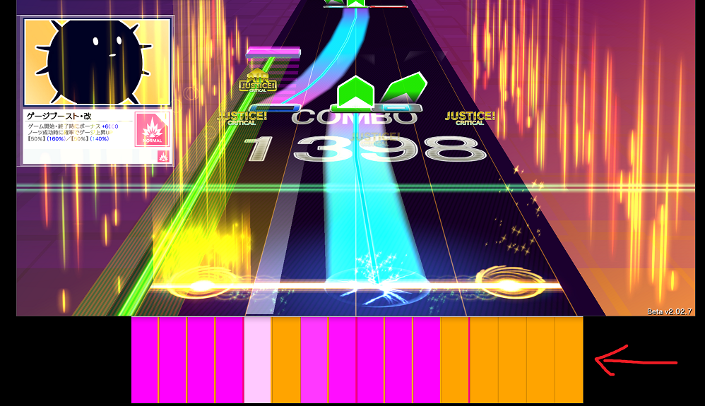

# UmiguriSampleLedServer
The server-side reference implementation of *UMIGURI LED Controller Protocol v1*.  
About the protocol, see [this specification document](https://gist.github.com/inonote/00251fed881a82c9df1e505eef1722bc).  


This sample has an ability to simulate slider lighting. Compatible with UMIGURI v1.0 and v2.0.



## Build

1. Clone this repo
```
git clone --recursive https://github.com/inonote/UmiguriSampleLedServer
```
2. Open `UmiguriSampleLedServer.sln` within Visual Studio 2022
3. Click **Build** > **Build Solution** then the app will be built in `/x64/Debug` or `/x64/Release` directory.

## Usage
1. First, run the built `UmiguriSampleLedServer.exe`.
> When the firewall alert appeared, check **Private networks** then click **Allow access**.

2. Open UMIGURI launcher then click **Config**.
3. Check **Slider LED Controller** and put a port number (default is 8090).
4. Click **Save changes** then launch the game.

## License
MIT
